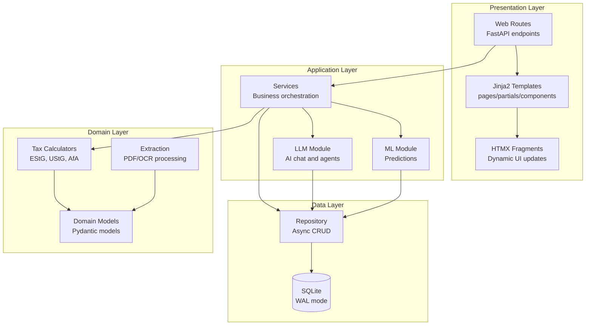
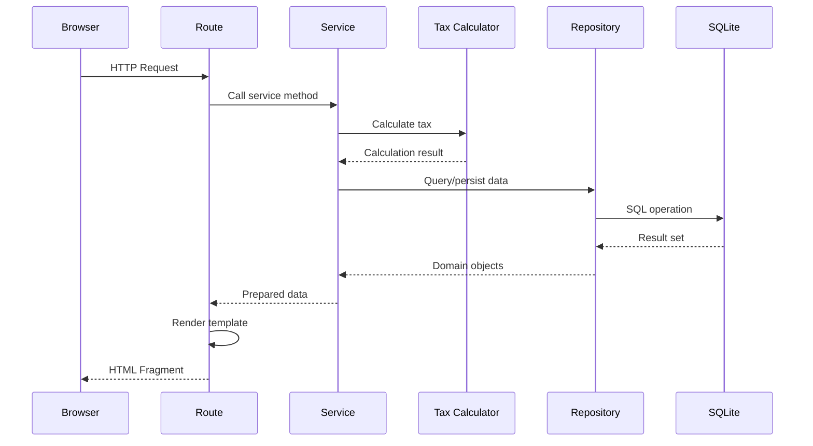
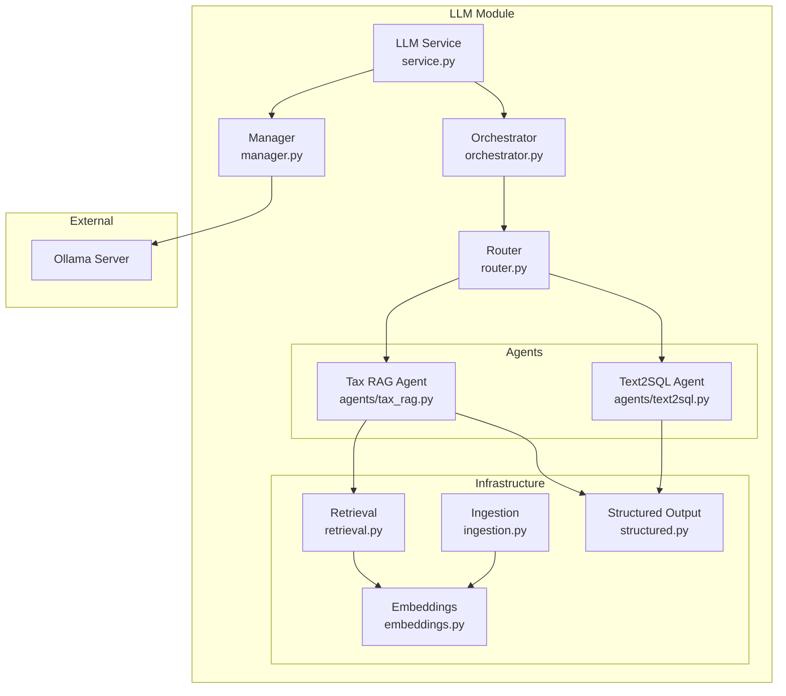

# FiscFox Architecture

This document describes the system architecture, component relationships, and data flow patterns in FiscFox.

## Table of Contents

- [Architecture Principles](#architecture-principles)
- [System Overview](#system-overview)
- [Layer Architecture](#layer-architecture)
- [Request Flow](#request-flow)
- [LLM Architecture](#llm-architecture)
- [Directory Structure](#directory-structure)
- [Component Descriptions](#component-descriptions)

## Architecture Principles

FiscFox follows these core architectural principles:

| Principle | Description |
|-----------|-------------|
| Hypermedia-First | Routes return HTML fragments for HTMX consumption. No JSON APIs. |
| Financial Precision | All monetary values use `Decimal`, never `float`. Stored as TEXT in SQLite. |
| Tax Law Isolation | Core tax calculations are pure functions with no framework dependencies. |
| Soft Deletes | Financial records are never truly deleted for audit compliance. |
| Offline-First | All ML and LLM features run locally without internet. |
| Privacy-First | No cloud sync, no telemetry, no external API calls. |

## System Overview



## Layer Architecture

### Presentation Layer

Handles HTTP requests and HTML rendering:

- **Routes** (`src/web/routes/`): FastAPI endpoints that return HTML
- **Templates** (`src/web/templates/`): Jinja2 templates organized as pages, partials, and components
- **HTMX Integration**: Dynamic updates via HTML fragments and OOB swaps

### Application Layer

Orchestrates business logic and coordinates between domain and data layers:

- **Services** (`src/web/services/`): Business logic orchestration
- **LLM Module** (`src/llm/`): AI chat, RAG, and specialized agents
- **ML Module** (`src/ml/`): TabPFN predictions and Prophet forecasting

### Domain Layer

Pure business logic with no framework dependencies:

- **Tax Calculators** (`src/core/tax/`): German tax calculations with law citations
- **Models** (`src/core/models.py`): Pydantic models and tax year configurations
- **Extraction** (`src/core/extraction/`): PDF text extraction and OCR

### Data Layer

Data persistence and retrieval:

- **Repository** (`src/db/repository.py`): Async CRUD operations with aiosqlite
- **SQLite**: WAL mode enabled, foreign keys enforced, strict mode

## Request Flow



### HTMX Patterns

FiscFox uses HTMX for dynamic interactions:

| Pattern | Usage |
|---------|-------|
| `hx-get` | Load partials into containers |
| `hx-post` | Form submissions returning HTML |
| `hx-swap-oob` | Update distant DOM elements |
| `hx-trigger` | Custom event handling |

Form containers follow the scroll behavior pattern:
- Pages are non-scrollable by default
- `updateMainScroll()` enables scrolling when forms open
- Forms close handlers reset scroll behavior

## LLM Architecture



### LLM Components

| Component | File | Description |
|-----------|------|-------------|
| Service | `service.py` | Main entry point for LLM operations |
| Orchestrator | `orchestrator.py` | Multi-agent coordination |
| Router | `router.py` | Intent classification and agent routing |
| Manager | `manager.py` | Ollama model management |
| Embeddings | `embeddings.py` | Text vectorization |
| Retrieval | `retrieval.py` | RAG document retrieval |
| Ingestion | `ingestion.py` | Document processing pipeline |
| Structured | `structured.py` | JSON schema output parsing |

### Agent Types

| Agent | Purpose |
|-------|---------|
| Tax RAG | German tax law knowledge retrieval |
| Text2SQL | Natural language to SQL queries |

## Directory Structure

```
src/
├── core/                       # Pure domain logic (NO framework imports)
│   ├── models.py               # Pydantic models, TaxYearConfig, enums
│   ├── i18n.py                 # Internationalization (DE/EN)
│   ├── cache.py                # Caching utilities
│   ├── exceptions.py           # Domain exceptions
│   ├── tax/                    # German tax calculators
│   │   ├── einkommensteuer.py  # Income tax (Section 32a EStG)
│   │   ├── umsatzsteuer.py     # VAT, Vorsteuer (Section 19 UStG)
│   │   ├── deadlines.py        # Tax deadline calculation
│   │   ├── afa.py              # Depreciation (Section 7 EStG)
│   │   ├── reisekosten.py      # Travel expenses (Section 9 Abs. 4a EStG)
│   │   ├── geschenke.py        # Gift deductions (Section 4 Abs. 5 Nr. 1 EStG)
│   │   └── health_insurance.py # Health insurance (Section 10 EStG)
│   └── extraction/             # PDF/OCR data extraction
│       ├── extractor.py        # Main extraction orchestrator
│       ├── text_extractor.py   # PDF text extraction
│       ├── ocr_extractor.py    # OCR processing
│       ├── expense_ocr.py      # Receipt OCR
│       ├── expense_models.py   # OCR result models
│       ├── models.py           # Extraction data models
│       └── patterns.py         # Regex patterns for extraction
├── db/                         # Data access layer
│   ├── schema.sql              # SQLite schema (20+ tables, 10+ views)
│   ├── schema_rag.sql          # RAG/embeddings schema
│   ├── seed_data.py            # Initial data population
│   └── repository.py           # Async CRUD with aiosqlite
├── ml/                         # Machine Learning features
│   ├── base.py                 # Base ML utilities
│   ├── models.py               # Model definitions
│   ├── features.py             # Feature engineering
│   └── tabpfn_wrapper.py       # TabPFN integration
├── llm/                        # Local LLM integration
│   ├── config.py               # LLM configuration
│   ├── manager.py              # Ollama model management
│   ├── orchestrator.py         # Multi-agent orchestration
│   ├── router.py               # Intent routing
│   ├── service.py              # Main LLM service
│   ├── embeddings.py           # Text embeddings
│   ├── retrieval.py            # RAG retrieval
│   ├── ingestion.py            # Document ingestion
│   ├── structured.py           # Structured output parsing
│   ├── schemas.py              # LLM data schemas
│   ├── exceptions.py           # LLM-specific exceptions
│   └── agents/                 # Specialized agents
│       ├── tax_rag.py          # Tax knowledge RAG agent
│       └── text2sql.py         # Natural language to SQL
├── licensing/                  # License management
│   ├── license.py              # License validation
│   └── trial.py                # Trial period handling
├── web/                        # Application layer
│   ├── routes/                 # FastAPI endpoints (14 files)
│   │   ├── dashboard.py        # Main dashboard
│   │   ├── expenses.py         # Expense management
│   │   ├── invoices.py         # Invoice management
│   │   ├── clients.py          # Client management
│   │   ├── assets.py           # Asset depreciation (AfA)
│   │   ├── travel.py           # Travel expenses (Reisekosten)
│   │   ├── gifts.py            # Gift tracking (Geschenke)
│   │   ├── homeoffice.py       # Home office tracking
│   │   ├── bewirtung.py        # Business meals
│   │   ├── health_insurance.py # Health insurance (GKV/PKV)
│   │   ├── llm.py              # AI chat endpoints
│   │   ├── settings.py         # Application settings
│   │   ├── upload.py           # Document upload
│   │   └── pages.py            # Static page routes
│   ├── services/               # Business orchestration (18 files)
│   │   ├── dashboard.py        # Dashboard aggregation
│   │   ├── expense.py          # Expense logic
│   │   ├── invoice.py          # Invoice logic
│   │   ├── client.py           # Client logic
│   │   ├── asset.py            # Asset/depreciation logic
│   │   ├── travel.py           # Travel expense logic
│   │   ├── gift.py             # Gift tracking logic
│   │   ├── homeoffice.py       # Home office logic
│   │   ├── bewirtung.py        # Business meals logic
│   │   ├── health_insurance.py # Health insurance logic
│   │   ├── expense_ocr.py      # Receipt OCR service
│   │   ├── upload.py           # Upload processing
│   │   ├── report.py           # Report generation
│   │   ├── elster.py           # ELSTER XML export
│   │   ├── ml_expense.py       # Expense categorization ML
│   │   ├── ml_invoice_risk.py  # Invoice risk scoring ML
│   │   ├── ml_cashflow.py      # Cash flow forecasting ML
│   │   └── ml_tax_estimate.py  # Tax estimation ML
│   ├── models/                 # Web-specific models
│   │   └── reports.py          # Report data models
│   ├── middleware/             # HTTP middleware
│   │   └── rate_limit.py       # Rate limiting
│   ├── exception_handlers.py   # Error handling
│   └── templates/              # Jinja2 templates
│       ├── pages/              # Full page templates
│       ├── partials/           # HTMX fragments
│       └── components/         # Reusable UI components
└── main.py                     # Application entry point
```

## Component Descriptions

### Tax Calculators (`src/core/tax/`)

Pure Python functions implementing German tax law. Each module cites relevant law sections.

| Module | Purpose | Law Reference |
|--------|---------|---------------|
| `einkommensteuer.py` | Progressive income tax | Section 32a EStG |
| `umsatzsteuer.py` | VAT and input VAT | UStG, Section 19 |
| `afa.py` | Asset depreciation | Section 7 EStG |
| `reisekosten.py` | Per diem and km rates | Section 9 Abs. 4a EStG |
| `geschenke.py` | Gift limit tracking | Section 4 Abs. 5 Nr. 1 EStG |
| `health_insurance.py` | Insurance deductions | Section 10 EStG |
| `deadlines.py` | Tax filing deadlines | AO |

### Services (`src/web/services/`)

Business logic orchestration between routes and data layer.

| Service | Responsibility |
|---------|----------------|
| `dashboard.py` | Aggregate financial data with tax calculations |
| `expense.py` | Expense CRUD with VAT handling |
| `invoice.py` | Invoice management with reverse charge |
| `asset.py` | Depreciation calculation and tracking |
| `travel.py` | Per diem and km allowance calculation |
| `gift.py` | Cumulative gift limit enforcement |
| `elster.py` | ELSTER XML export generation |
| `ml_*.py` | Machine learning predictions |

### Repository (`src/db/repository.py`)

Async database operations with:
- Soft delete support (`deleted_at` timestamp)
- Storno (reversal) pattern for corrections
- Audit logging via triggers
- WAL mode for concurrent access

### Machine Learning (`src/ml/`)

| Component | Technology | Purpose |
|-----------|------------|---------|
| `tabpfn_wrapper.py` | TabPFN 2.5 | Expense categorization, invoice risk |
| `features.py` | scikit-learn | Feature engineering |
| `models.py` | Prophet | Cash flow forecasting |

All models train locally on user data with no external API calls.
