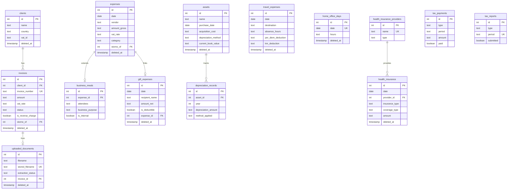

# FiscFox Database Schema

This document describes the SQLite database schema, entity relationships, and data integrity rules.

## Table of Contents

- [Overview](#overview)
- [Entity Relationship Diagram](#entity-relationship-diagram)
- [Core Tables](#core-tables)
- [Tax Optimization Tables](#tax-optimization-tables)
- [Health Insurance Tables](#health-insurance-tables)
- [System Tables](#system-tables)
- [Views](#views)
- [Triggers](#triggers)
- [Data Integrity Rules](#data-integrity-rules)

## Overview

FiscFox uses SQLite with the following configuration:

```sql
PRAGMA journal_mode = WAL;    -- Write-Ahead Logging for concurrent access
PRAGMA foreign_keys = ON;      -- Enforce referential integrity
PRAGMA strict = ON;            -- Strict type checking
```

**Key Principles**:
- All monetary values stored as TEXT (Decimal strings) for precision
- Soft deletes via `deleted_at` timestamp
- Storno (reversal) pattern for immutable financial records
- Audit logging via triggers

## Entity Relationship Diagram



## Core Tables

### clients

Client records for invoicing and tax compliance.

| Column | Type | Constraints | Description |
|--------|------|-------------|-------------|
| id | INTEGER | PRIMARY KEY | Auto-incrementing ID |
| name | TEXT | NOT NULL, 1-200 chars | Client name |
| street | TEXT | DEFAULT '' | Street address |
| address_details | TEXT | DEFAULT '' | Building, apartment |
| zip_code | TEXT | DEFAULT '' | Postal code |
| city | TEXT | DEFAULT '' | City |
| country | TEXT | DEFAULT 'DE', 2 chars | ISO 3166-1 alpha-2 |
| email | TEXT | DEFAULT '' | Email address |
| phone | TEXT | DEFAULT '' | Phone number |
| vat_id | TEXT | DEFAULT '' | EU VAT ID |
| notes | TEXT | DEFAULT '' | Additional notes |
| created_at | TIMESTAMP | DEFAULT CURRENT_TIMESTAMP | Creation time |
| updated_at | TIMESTAMP | DEFAULT CURRENT_TIMESTAMP | Last update |
| deleted_at | TIMESTAMP | DEFAULT NULL | Soft delete marker |

**Indexes**: `idx_clients_name`, `idx_clients_country`

### expenses

Business expense records with VAT tracking.

| Column | Type | Constraints | Description |
|--------|------|-------------|-------------|
| id | INTEGER | PRIMARY KEY | Auto-incrementing ID |
| date | DATE | NOT NULL | Expense date |
| vendor | TEXT | NOT NULL, 1-200 chars | Vendor name |
| description | TEXT | NOT NULL, 3-500 chars | Expense description |
| amount_gross | TEXT | NOT NULL | Gross amount (Decimal) |
| amount_net | TEXT | NOT NULL | Net amount (Decimal) |
| vat_amount | TEXT | NOT NULL | VAT (Vorsteuer) amount |
| vat_rate | TEXT | CHECK IN ('0.19', '0.07', '0.00') | VAT rate |
| category | TEXT | CHECK IN (10 categories) | Expense category |
| created_at | TIMESTAMP | DEFAULT CURRENT_TIMESTAMP | Creation time |
| updated_at | TIMESTAMP | DEFAULT CURRENT_TIMESTAMP | Last update |
| deleted_at | TIMESTAMP | DEFAULT NULL | Soft delete marker |
| storno_of | INTEGER | REFERENCES expenses(id) | Reversal reference |
| is_storno | BOOLEAN | DEFAULT FALSE | Is reversal flag |

**Categories**: buero, software, hardware, reise, kommunikation, versicherung, fortbildung, bewirtung, geschenke, sonstiges

**Indexes**: `idx_expenses_date`, `idx_expenses_category`, `idx_expenses_vendor`

### invoices

Client invoice records with VAT and reverse charge handling.

| Column | Type | Constraints | Description |
|--------|------|-------------|-------------|
| id | INTEGER | PRIMARY KEY | Auto-incrementing ID |
| client_id | INTEGER | REFERENCES clients(id) | Client foreign key |
| client | TEXT | NOT NULL, 1-200 chars | Client name (denormalized) |
| invoice_number | TEXT | NOT NULL, UNIQUE | Invoice identifier |
| date | DATE | NOT NULL | Invoice date |
| due_date | DATE | | Payment due date |
| amount | TEXT | NOT NULL | Total amount (Decimal) |
| amount_net | TEXT | NOT NULL | Net before VAT |
| vat_amount | TEXT | NOT NULL | VAT (Umsatzsteuer) |
| vat_rate | TEXT | CHECK IN ('0.19', '0.07', '0.00') | VAT rate |
| description | TEXT | NOT NULL, 3-1000 chars | Services description |
| status | TEXT | DEFAULT 'pending' | pending/paid/overdue |
| paid_date | DATE | | Actual payment date |
| is_reverse_charge | BOOLEAN | DEFAULT FALSE | Reverse charge flag |
| client_country | TEXT | | ISO country code |
| client_vat_id | TEXT | | Client EU VAT ID |
| storno_of | INTEGER | REFERENCES invoices(id) | Reversal reference |
| is_storno | BOOLEAN | DEFAULT FALSE | Is reversal flag |
| uploaded_document_id | INTEGER | REFERENCES uploaded_documents(id) | Source document |

**Indexes**: `idx_invoices_date`, `idx_invoices_status`, `idx_invoices_client`, `idx_invoices_client_id`, `idx_invoices_due_date`

### tax_payments

Track tax payment obligations and status.

| Column | Type | Constraints | Description |
|--------|------|-------------|-------------|
| id | INTEGER | PRIMARY KEY | Auto-incrementing ID |
| type | TEXT | CHECK IN (5 types) | Tax type |
| period | TEXT | NOT NULL | Period (2026-Q1, 2026-01) |
| due_date | DATE | NOT NULL | Payment due date |
| amount | TEXT | NOT NULL | Payment amount (Decimal) |
| paid | BOOLEAN | DEFAULT FALSE | Payment status |
| paid_date | DATE | | Actual payment date |
| payment_reference | TEXT | | Bank/Finanzamt reference |
| notes | TEXT | | Additional notes |

**Types**: einkommensteuer, umsatzsteuer, gewerbesteuer, solidaritaetszuschlag, kirchensteuer

### tax_reports

Track submitted tax reports.

| Column | Type | Constraints | Description |
|--------|------|-------------|-------------|
| id | INTEGER | PRIMARY KEY | Auto-incrementing ID |
| type | TEXT | CHECK IN (4 types) | Report type |
| period | TEXT | NOT NULL | Period identifier |
| year | INTEGER | NOT NULL | Tax year |
| umsatz_net | TEXT | | Total net revenue |
| umsatzsteuer | TEXT | | USt collected |
| vorsteuer | TEXT | | Input VAT |
| zahllast | TEXT | | Net VAT liability |
| reverse_charge_total | TEXT | | Reverse charge total |
| submitted | BOOLEAN | DEFAULT FALSE | Submission status |
| submitted_date | DATE | | Submission date |
| elster_reference | TEXT | | ELSTER reference |

**Types**: ust_voranmeldung, zusammenfassende_meldung, euer, steuererklaerung

**Unique Index**: `(type, period)`

## Tax Optimization Tables

### assets

Fixed assets for depreciation (AfA) tracking.

| Column | Type | Constraints | Description |
|--------|------|-------------|-------------|
| id | INTEGER | PRIMARY KEY | Auto-incrementing ID |
| name | TEXT | NOT NULL, 1-200 chars | Asset name |
| description | TEXT | DEFAULT '' | Asset description |
| purchase_date | DATE | NOT NULL | Acquisition date |
| acquisition_cost | TEXT | NOT NULL | Net purchase price |
| vat_amount | TEXT | NOT NULL | VAT paid (Vorsteuer) |
| vat_rate | TEXT | CHECK IN ('0.19', '0.07', '0.00') | VAT rate |
| category | TEXT | CHECK IN (7 types) | Asset category |
| useful_life_years | INTEGER | NOT NULL, > 0 | Useful life in years |
| depreciation_method | TEXT | CHECK IN (5 methods) | Depreciation method |
| pool_year | INTEGER | | Pool assignment year |
| current_book_value | TEXT | NOT NULL | Residual value |
| total_depreciated | TEXT | DEFAULT '0' | Total depreciation |
| depreciation_complete | BOOLEAN | DEFAULT FALSE | Fully depreciated |
| private_use_percent | TEXT | DEFAULT '0' | Private use % |
| disposal_date | DATE | | Disposal date |
| disposal_amount | TEXT | | Sale price |

**Categories**: computer, software, office, vehicle, furniture, machinery, other

**Methods**: immediate, linear, degressive, pool, digital

### depreciation_records

Annual depreciation entries per asset.

| Column | Type | Constraints | Description |
|--------|------|-------------|-------------|
| id | INTEGER | PRIMARY KEY | Auto-incrementing ID |
| asset_id | INTEGER | NOT NULL, FK | Asset reference |
| year | INTEGER | NOT NULL | Depreciation year |
| depreciation_amount | TEXT | NOT NULL | Amount for year |
| book_value_start | TEXT | NOT NULL | Value at year start |
| book_value_end | TEXT | NOT NULL | Value at year end |
| method_applied | TEXT | CHECK IN (5 methods) | Method used |
| months_applicable | INTEGER | DEFAULT 12 | Months owned |
| notes | TEXT | | Additional notes |

**Unique Constraint**: `(asset_id, year)`

### travel_expenses

Travel expense records with per diem and km tracking.

| Column | Type | Constraints | Description |
|--------|------|-------------|-------------|
| id | INTEGER | PRIMARY KEY | Auto-incrementing ID |
| date | DATE | NOT NULL | Travel date |
| destination | TEXT | NOT NULL, 1-200 chars | Destination |
| purpose | TEXT | NOT NULL, 3-500 chars | Business purpose |
| departure_time | TEXT | | Departure time |
| return_time | TEXT | | Return time |
| absence_hours | TEXT | NOT NULL | Hours away (Decimal) |
| is_overnight | BOOLEAN | DEFAULT FALSE | Overnight trip |
| is_travel_day | BOOLEAN | DEFAULT FALSE | Arrival/departure day |
| km_driven | TEXT | DEFAULT '0' | Kilometers driven |
| km_rate | TEXT | DEFAULT '0.30' | Rate per km |
| km_deduction | TEXT | DEFAULT '0' | Km deduction amount |
| country_code | TEXT | DEFAULT 'DE', 2 chars | Country code |
| per_diem_rate | TEXT | NOT NULL | Base per diem |
| breakfast_provided | BOOLEAN | DEFAULT FALSE | Breakfast provided |
| lunch_provided | BOOLEAN | DEFAULT FALSE | Lunch provided |
| dinner_provided | BOOLEAN | DEFAULT FALSE | Dinner provided |
| meal_reduction | TEXT | DEFAULT '0' | Meal reduction |
| per_diem_deduction | TEXT | NOT NULL | Final per diem |
| total_deduction | TEXT | NOT NULL | Total deduction |
| linked_expense_id | INTEGER | REFERENCES expenses(id) | Related expense |

### gift_expenses

Gift expense tracking with 50 EUR limit enforcement.

| Column | Type | Constraints | Description |
|--------|------|-------------|-------------|
| id | INTEGER | PRIMARY KEY | Auto-incrementing ID |
| date | DATE | NOT NULL | Gift date |
| recipient_name | TEXT | NOT NULL, 1-200 chars | Recipient name |
| recipient_company | TEXT | DEFAULT '' | Company name |
| description | TEXT | NOT NULL, 3-500 chars | Gift description |
| amount_net | TEXT | NOT NULL | Net amount |
| vat_amount | TEXT | NOT NULL | VAT amount |
| vat_rate | TEXT | CHECK IN ('0.19', '0.07', '0.00') | VAT rate |
| is_deductible | BOOLEAN | DEFAULT TRUE | Deductibility flag |
| cumulative_year_total | TEXT | NOT NULL | Year total for recipient |
| flat_tax_paid | BOOLEAN | DEFAULT FALSE | Section 37b tax |
| flat_tax_amount | TEXT | DEFAULT '0' | Flat tax amount |
| expense_id | INTEGER | REFERENCES expenses(id) | Linked expense |

**Index**: `idx_gift_recipient_year` on `(recipient_name, year)`

### home_office_days

Track work-from-home days.

| Column | Type | Constraints | Description |
|--------|------|-------------|-------------|
| id | INTEGER | PRIMARY KEY | Auto-incrementing ID |
| date | DATE | NOT NULL, UNIQUE | Work date |
| hours | TEXT | | Hours worked |
| notes | TEXT | DEFAULT '' | Notes |

### home_office_settings

Annual home office configuration.

| Column | Type | Constraints | Description |
|--------|------|-------------|-------------|
| id | INTEGER | PRIMARY KEY | Auto-incrementing ID |
| year | INTEGER | UNIQUE, NOT NULL | Tax year |
| method_type | TEXT | CHECK IN (2 types) | pauschale/arbeitszimmer |
| room_sqm | TEXT | | Room size (sqm) |
| total_sqm | TEXT | | Total home size |
| monthly_rent | TEXT | | Monthly rent |
| monthly_utilities | TEXT | | Monthly utilities |

### business_meals

Extended data for business meal expenses.

| Column | Type | Constraints | Description |
|--------|------|-------------|-------------|
| id | INTEGER | PRIMARY KEY | Auto-incrementing ID |
| expense_id | INTEGER | NOT NULL, FK | Linked expense |
| attendees | TEXT | NOT NULL | JSON array of names |
| business_purpose | TEXT | NOT NULL, 10+ chars | Purpose description |
| is_internal | BOOLEAN | DEFAULT FALSE | Staff event flag |
| attendee_count | INTEGER | NOT NULL, DEFAULT 1 | Number of attendees |
| deductible_amount | TEXT | NOT NULL | Deductible portion |
| non_deductible_amount | TEXT | NOT NULL | Non-deductible portion |

## Health Insurance Tables

### health_insurance_providers

Pre-loaded GKV and PKV providers.

| Column | Type | Constraints | Description |
|--------|------|-------------|-------------|
| id | INTEGER | PRIMARY KEY | Auto-incrementing ID |
| name | TEXT | NOT NULL, UNIQUE | Provider name |
| short_name | TEXT | | Abbreviated name |
| type | TEXT | CHECK IN ('gkv', 'pkv') | Insurance type |
| logo_filename | TEXT | | Logo file |
| website | TEXT | | Provider website |
| is_nationwide | BOOLEAN | DEFAULT TRUE | Nationwide flag |

**Seed Data**: 30+ GKV providers, 30+ PKV providers

### health_insurance

Health insurance payment records.

| Column | Type | Constraints | Description |
|--------|------|-------------|-------------|
| id | INTEGER | PRIMARY KEY | Auto-incrementing ID |
| date | DATE | NOT NULL | Payment date |
| provider_id | INTEGER | NOT NULL, FK | Provider reference |
| insurance_type | TEXT | CHECK IN ('gkv', 'pkv') | Type |
| coverage_type | TEXT | CHECK IN (4 types) | Coverage category |
| amount | TEXT | NOT NULL | Payment amount |
| has_krankengeld | BOOLEAN | DEFAULT FALSE | Sick pay entitlement |
| policy_number | TEXT | DEFAULT '' | Policy number |
| notes | TEXT | DEFAULT '' | Notes |

**Coverage Types**: basis_krankenversicherung, pflegepflichtversicherung, wahlleistungen, zusatzversicherung

## System Tables

### settings

Application configuration key-value store.

| Column | Type | Constraints | Description |
|--------|------|-------------|-------------|
| key | TEXT | PRIMARY KEY | Setting key |
| value | TEXT | NOT NULL | Setting value |
| description | TEXT | | Setting description |
| updated_at | TIMESTAMP | | Last update |

**Default Settings**:
- tax_year: '2026'
- ust_frequency: 'monthly'
- is_kleinunternehmer: 'false'
- is_freiberufler: 'true'
- has_eu_clients: 'true'
- quarterly_est_amount: '3500.00'
- business_name, steuernummer, ust_id, finanzamt

### audit_log

Change tracking for all tables.

| Column | Type | Constraints | Description |
|--------|------|-------------|-------------|
| id | INTEGER | PRIMARY KEY | Auto-incrementing ID |
| table_name | TEXT | NOT NULL | Source table |
| record_id | INTEGER | NOT NULL | Record ID |
| action | TEXT | CHECK IN (4 types) | INSERT/UPDATE/DELETE/STORNO |
| old_values | TEXT | | JSON of old values |
| new_values | TEXT | | JSON of new values |
| user_id | TEXT | | User identifier |
| timestamp | TIMESTAMP | DEFAULT CURRENT_TIMESTAMP | Change time |

### uploaded_documents

PDF and image upload storage with extraction metadata.

| Column | Type | Constraints | Description |
|--------|------|-------------|-------------|
| id | INTEGER | PRIMARY KEY | Auto-incrementing ID |
| filename | TEXT | NOT NULL, 1-255 chars | Original filename |
| stored_filename | TEXT | NOT NULL, UNIQUE | UUID storage name |
| file_path | TEXT | NOT NULL | Relative path |
| file_size | INTEGER | NOT NULL, > 0 | File size bytes |
| content_hash | TEXT | NOT NULL | SHA-256 hash |
| mime_type | TEXT | DEFAULT 'application/pdf' | MIME type |
| extraction_status | TEXT | CHECK IN (5 states) | Processing status |
| extraction_confidence | REAL | 0.0-1.0 | Confidence score |
| extraction_method | TEXT | CHECK IN (4 methods) | Extraction method |
| extracted_data | TEXT | | JSON extracted data |
| extraction_errors | TEXT | | JSON error list |
| invoice_id | INTEGER | REFERENCES invoices(id) | Linked invoice |

**Status**: pending, processing, completed, failed, manual

**Methods**: text, ocr, ai, manual

## Views

### v_monthly_revenue

Monthly revenue aggregation.

```sql
SELECT
    strftime('%Y-%m', date) AS month,
    COUNT(*) AS invoice_count,
    SUM(amount_net) AS total_net,
    SUM(vat_amount) AS total_vat,
    SUM(amount) AS total_gross,
    SUM(reverse_charge_total) AS reverse_charge_total
FROM invoices
WHERE deleted_at IS NULL AND is_storno = FALSE
GROUP BY month
```

### v_monthly_expenses

Monthly expense aggregation.

### v_expense_categories

Expense breakdown by category and year.

### v_vat_summary

VAT summary for USt-Voranmeldung.

| Column | Description |
|--------|-------------|
| period | Month (YYYY-MM) |
| ust_collected | Umsatzsteuer from invoices |
| vorsteuer | Input VAT from expenses |
| zahllast | Net VAT liability |

### v_annual_depreciation

Depreciation summary by year and category.

### v_travel_summary

Travel expense totals by year and month.

### v_gift_summary

Gift totals by recipient and year.

### v_home_office_summary

Home office days and deduction by year.

### v_health_insurance_summary

Health insurance payments with deductibility by year.

## Triggers

### Audit Triggers

All core tables have INSERT and UPDATE audit triggers:

- `trg_expenses_audit_insert` / `trg_expenses_audit_update`
- `trg_invoices_audit_insert` / `trg_invoices_audit_update`
- `trg_clients_audit_insert` / `trg_clients_audit_update`
- `trg_assets_audit_insert` / `trg_assets_audit_update`
- `trg_travel_audit_insert`
- `trg_gift_audit_insert`
- `trg_uploaded_docs_audit_insert` / `trg_uploaded_docs_audit_update`
- `trg_health_insurance_audit_insert` / `trg_health_insurance_audit_update`

### Updated Timestamp Triggers

Auto-update `updated_at` on UPDATE:

- `trg_expenses_updated_at`
- `trg_invoices_updated_at`
- `trg_clients_updated_at`
- `trg_assets_updated_at`
- `trg_travel_updated_at`
- `trg_gift_updated_at`
- `trg_health_insurance_updated_at`

## Data Integrity Rules

### Monetary Values

All monetary values are stored as TEXT containing Decimal strings:

```python
# In Python
amount.quantize(Decimal("0.01"))  # Always 2 decimal places

# In SQL
CAST(amount AS REAL)  # Only for calculations in views
```

### Soft Deletes

Records are never physically deleted:

```sql
-- Delete operation
UPDATE expenses SET deleted_at = CURRENT_TIMESTAMP WHERE id = ?;

-- Query active records
SELECT * FROM expenses WHERE deleted_at IS NULL;
```

### Storno Pattern

Financial records are immutable. Corrections via reversal:

```sql
-- Create reversal
INSERT INTO expenses (..., storno_of, is_storno)
VALUES (..., original_id, TRUE);

-- Query excludes stornos
WHERE is_storno = FALSE
```

### Foreign Key Enforcement

All relationships are enforced:

```sql
PRAGMA foreign_keys = ON;

-- Example constraint
client_id INTEGER REFERENCES clients(id)
```

### Check Constraints

Data validation at database level:

```sql
-- Category validation
category TEXT NOT NULL CHECK (category IN (...))

-- Rate validation
vat_rate TEXT NOT NULL CHECK (vat_rate IN ('0.19', '0.07', '0.00'))

-- Length validation
name TEXT NOT NULL CHECK (length(name) >= 1 AND length(name) <= 200)
```
