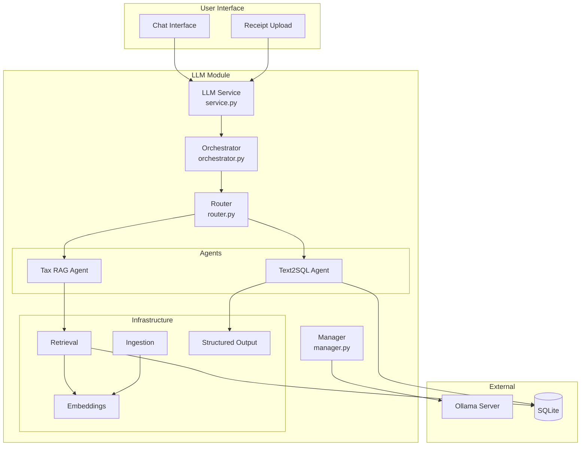

# FiscFox LLM Integration

This document describes the local LLM integration for AI-powered features in FiscFox.

## Table of Contents

- [Overview](#overview)
- [Architecture](#architecture)
- [Setup](#setup)
- [Components](#components)
- [Agents](#agents)
- [RAG System](#rag-system)
- [Configuration](#configuration)
- [Extending](#extending)
- [Troubleshooting](#troubleshooting)

## Overview

FiscFox includes local LLM integration for:

- **AI Chat**: Natural language interface for tax questions
- **Tax RAG**: Retrieval-augmented generation for German tax law
- **Text-to-SQL**: Natural language database queries
- **Receipt OCR Enhancement**: LLM-assisted data extraction

All processing runs locally via Ollama. No data leaves your device.

## Architecture



## Setup

### Install Ollama

```bash
# macOS
brew install ollama

# Linux
curl -fsSL https://ollama.com/install.sh | sh

# Start Ollama server
ollama serve
```

### Pull Models

```bash
# Recommended models
ollama pull llama3
ollama pull mistral

# For embeddings
ollama pull nomic-embed-text
```

### Environment Variables

| Variable | Default | Description |
|----------|---------|-------------|
| `OLLAMA_HOST` | `http://localhost:11434` | Ollama server URL |
| `LLM_MODEL` | `llama3` | Default model for chat |
| `EMBEDDING_MODEL` | `nomic-embed-text` | Model for embeddings |

### Verify Installation

```bash
# Check Ollama is running
curl http://localhost:11434/api/tags

# Test model
ollama run llama3 "Hello, world!"
```

## Components

### LLM Service (`service.py`)

Main entry point for LLM operations:

```python
from src.llm.service import LLMService

service = LLMService()

# Chat completion
response = await service.chat("What is Vorsteuer?")

# Stream response
async for chunk in service.stream_chat("Explain AfA"):
    print(chunk, end="")
```

### Orchestrator (`orchestrator.py`)

Coordinates multi-agent workflows:

```python
from src.llm.orchestrator import Orchestrator

orchestrator = Orchestrator()

# Execute complex query with agent selection
result = await orchestrator.execute(
    query="How much VAT did I pay in Q3?",
    context={"user_id": 1}
)
```

### Router (`router.py`)

Intent classification and agent selection:

```python
from src.llm.router import Router

router = Router()

# Classify query intent
intent = await router.classify("What expenses can I deduct?")
# Returns: {"intent": "tax_question", "agent": "tax_rag"}

intent = await router.classify("Show my monthly revenue")
# Returns: {"intent": "data_query", "agent": "text2sql"}
```

### Manager (`manager.py`)

Ollama model lifecycle management:

```python
from src.llm.manager import ModelManager

manager = ModelManager()

# List available models
models = await manager.list_models()

# Pull new model
await manager.pull_model("codellama")

# Check model status
status = await manager.get_status("llama3")
```

### Embeddings (`embeddings.py`)

Text vectorization for RAG:

```python
from src.llm.embeddings import EmbeddingService

embeddings = EmbeddingService()

# Generate embedding
vector = await embeddings.embed("German income tax")

# Batch embeddings
vectors = await embeddings.embed_batch([
    "Einkommensteuer",
    "Umsatzsteuer",
    "AfA"
])
```

### Structured Output (`structured.py`)

JSON schema-based parsing:

```python
from src.llm.structured import StructuredParser

parser = StructuredParser()

# Parse receipt data
schema = {
    "type": "object",
    "properties": {
        "vendor": {"type": "string"},
        "amount": {"type": "number"},
        "date": {"type": "string", "format": "date"}
    }
}

result = await parser.parse(
    text="Receipt from Amazon 49.99 EUR 2024-01-15",
    schema=schema
)
# Returns: {"vendor": "Amazon", "amount": 49.99, "date": "2024-01-15"}
```

## Agents

### Tax RAG Agent (`agents/tax_rag.py`)

Retrieval-augmented generation for German tax questions:

**Capabilities**:
- Answer questions about German tax law
- Cite relevant EStG/UStG sections
- Explain tax optimization strategies
- Provide calculation examples

**Usage**:
```python
from src.llm.agents.tax_rag import TaxRAGAgent

agent = TaxRAGAgent()

response = await agent.query(
    "What is the limit for gift deductions?"
)
# Returns answer with Section 4 Abs. 5 Nr. 1 EStG citation
```

**Knowledge Sources**:
- German tax law sections (EStG, UStG)
- BMF circulars
- Tax calculation formulas
- Deduction rules and limits

### Text2SQL Agent (`agents/text2sql.py`)

Natural language to SQL query conversion:

**Capabilities**:
- Convert questions to SQL queries
- Execute queries against FiscFox database
- Format results for display
- Handle aggregations and date ranges

**Usage**:
```python
from src.llm.agents.text2sql import Text2SQLAgent

agent = Text2SQLAgent()

result = await agent.query(
    "What was my total revenue in 2024?"
)
# Generates: SELECT SUM(amount_net) FROM invoices WHERE ...
```

**Supported Query Types**:
- Revenue summaries (by period, client)
- Expense breakdowns (by category, vendor)
- VAT calculations
- Invoice status queries
- Client analysis

## RAG System

### Retrieval (`retrieval.py`)

Document retrieval for RAG:

```python
from src.llm.retrieval import Retriever

retriever = Retriever()

# Search for relevant documents
docs = await retriever.search(
    query="Depreciation methods for software",
    top_k=5
)

for doc in docs:
    print(f"Score: {doc.score}")
    print(f"Content: {doc.content}")
    print(f"Source: {doc.metadata['source']}")
```

### Ingestion (`ingestion.py`)

Document processing and indexing:

```python
from src.llm.ingestion import DocumentIngestion

ingestion = DocumentIngestion()

# Ingest tax law document
await ingestion.ingest_document(
    path="/path/to/tax_law.pdf",
    metadata={"source": "EStG", "type": "legislation"}
)

# Ingest text content
await ingestion.ingest_text(
    content="Section 32a defines the income tax formula...",
    metadata={"source": "EStG Section 32a"}
)
```

### Database Schema

RAG data stored in `src/db/schema_rag.sql`:

```sql
-- Embeddings storage
CREATE TABLE embeddings (
    id INTEGER PRIMARY KEY,
    content TEXT NOT NULL,
    embedding BLOB NOT NULL,
    metadata TEXT,  -- JSON
    created_at TIMESTAMP
);

-- Chat history
CREATE TABLE chat_history (
    id INTEGER PRIMARY KEY,
    session_id TEXT NOT NULL,
    role TEXT NOT NULL,  -- user/assistant
    content TEXT NOT NULL,
    created_at TIMESTAMP
);

-- Tax knowledge base
CREATE TABLE tax_knowledge (
    id INTEGER PRIMARY KEY,
    section TEXT NOT NULL,
    content TEXT NOT NULL,
    law TEXT NOT NULL,  -- EStG, UStG, etc.
    effective_from DATE,
    effective_to DATE
);
```

## Configuration

### LLM Configuration (`config.py`)

```python
from src.llm.config import LLMConfig

config = LLMConfig(
    ollama_host="http://localhost:11434",
    default_model="llama3",
    embedding_model="nomic-embed-text",
    temperature=0.7,
    max_tokens=2048,
    context_window=4096
)
```

### Model Selection

| Use Case | Recommended Model | Notes |
|----------|-------------------|-------|
| General chat | llama3 | Good balance of speed and quality |
| Complex reasoning | mistral | Better for tax calculations |
| Code/SQL | codellama | Better SQL generation |
| Fast responses | llama3:8b | Smaller, faster model |
| Embeddings | nomic-embed-text | Optimized for retrieval |

### Temperature Settings

| Task | Temperature | Rationale |
|------|-------------|-----------|
| Tax calculations | 0.1-0.3 | Precision required |
| Explanations | 0.5-0.7 | Balance of accuracy and fluency |
| Creative suggestions | 0.7-0.9 | More varied responses |

## Extending

### Adding a New Agent

1. Create agent file in `src/llm/agents/`:

```python
# src/llm/agents/new_agent.py

from src.llm.base import BaseAgent
from src.llm.schemas import AgentResponse

class NewAgent(BaseAgent):
    """Agent for [purpose]."""

    name = "new_agent"
    description = "Handles [type of queries]"

    async def query(self, input: str, context: dict = None) -> AgentResponse:
        """Process query and return response.

        Args:
            input: User query
            context: Optional context (user_id, session, etc.)

        Returns:
            AgentResponse with answer and metadata
        """
        # 1. Preprocess input
        processed = self._preprocess(input)

        # 2. Generate response
        response = await self.llm.generate(
            prompt=self._build_prompt(processed),
            system=self._system_prompt()
        )

        # 3. Postprocess
        return AgentResponse(
            answer=response.text,
            confidence=response.confidence,
            sources=[]
        )

    def _system_prompt(self) -> str:
        return """You are a helpful assistant specialized in..."""

    def _build_prompt(self, input: str) -> str:
        return f"User query: {input}\n\nPlease provide..."
```

2. Register in `src/llm/agents/__init__.py`:

```python
from .new_agent import NewAgent

AGENTS = {
    "tax_rag": TaxRAGAgent,
    "text2sql": Text2SQLAgent,
    "new_agent": NewAgent,
}
```

3. Add routing rules in `router.py`:

```python
ROUTING_RULES = {
    "new_agent": {
        "keywords": ["keyword1", "keyword2"],
        "patterns": [r"pattern.*match"],
        "priority": 1
    }
}
```

### Adding Knowledge Sources

1. Prepare documents (PDF, TXT, or Markdown)

2. Create ingestion script:

```python
from src.llm.ingestion import DocumentIngestion

async def ingest_new_knowledge():
    ingestion = DocumentIngestion()

    # Ingest PDF
    await ingestion.ingest_document(
        path="docs/new_source.pdf",
        metadata={
            "source": "Source Name",
            "type": "reference",
            "date": "2024-01-01"
        }
    )

    # Ingest from URL (if configured)
    await ingestion.ingest_url(
        url="https://example.com/tax-guide",
        metadata={"source": "Online Guide"}
    )

asyncio.run(ingest_new_knowledge())
```

3. Update retrieval filters if needed:

```python
# Filter by source type
docs = await retriever.search(
    query="query",
    filters={"type": "legislation"}
)
```

## Troubleshooting

### Common Issues

**Ollama not running**:
```bash
# Check status
systemctl status ollama  # Linux
brew services list | grep ollama  # macOS

# Start service
ollama serve
```

**Model not found**:
```bash
# List available models
ollama list

# Pull missing model
ollama pull llama3
```

**Slow responses**:
- Use smaller model (`llama3:8b` instead of `llama3`)
- Reduce `max_tokens` in config
- Check system resources (CPU/RAM usage)

**Out of memory**:
- Use quantized models (e.g., `llama3:8b-q4_0`)
- Reduce context window
- Close other applications

**Embedding errors**:
```bash
# Ensure embedding model is pulled
ollama pull nomic-embed-text

# Test embedding
curl http://localhost:11434/api/embeddings \
  -d '{"model": "nomic-embed-text", "prompt": "test"}'
```

### Logging

Enable debug logging:

```python
import logging
logging.getLogger("src.llm").setLevel(logging.DEBUG)
```

Log locations:
- LLM requests: `logs/llm.log`
- Retrieval: `logs/retrieval.log`
- Ingestion: `logs/ingestion.log`

### Performance Tuning

**For faster inference**:
1. Use GPU if available (requires Ollama GPU setup)
2. Use smaller models for simple tasks
3. Cache frequent queries

**For better quality**:
1. Use larger models (mistral, llama3:70b)
2. Increase temperature for explanations
3. Add more knowledge sources

### Health Check

```python
from src.llm.manager import ModelManager

async def health_check():
    manager = ModelManager()

    # Check Ollama connection
    if not await manager.is_connected():
        print("Ollama not connected")
        return False

    # Check required models
    models = await manager.list_models()
    required = ["llama3", "nomic-embed-text"]

    for model in required:
        if model not in models:
            print(f"Missing model: {model}")
            return False

    print("All systems operational")
    return True
```
